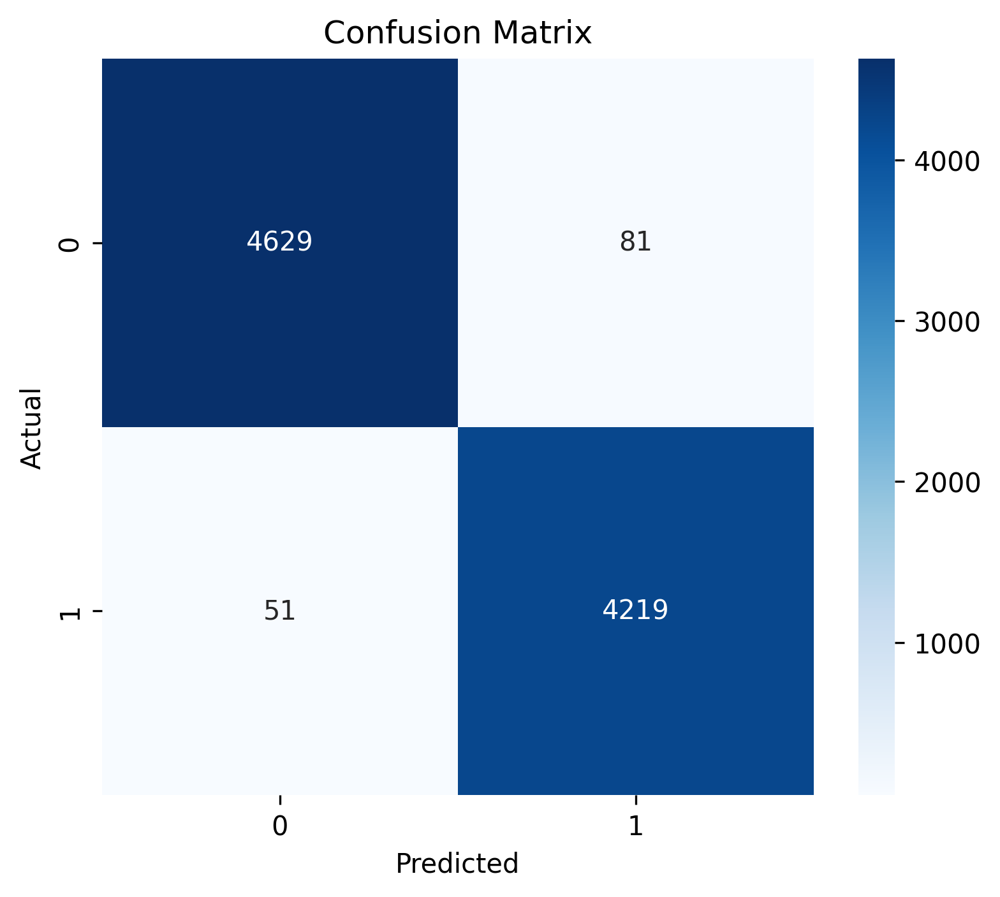
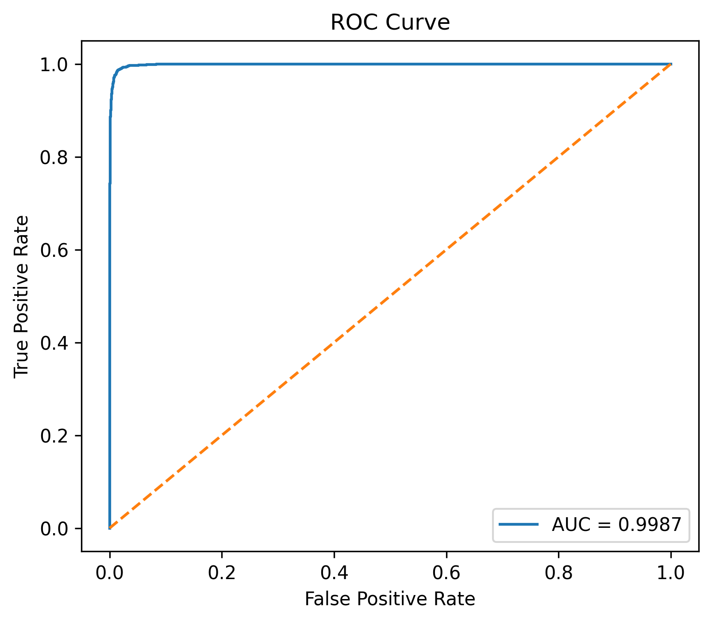
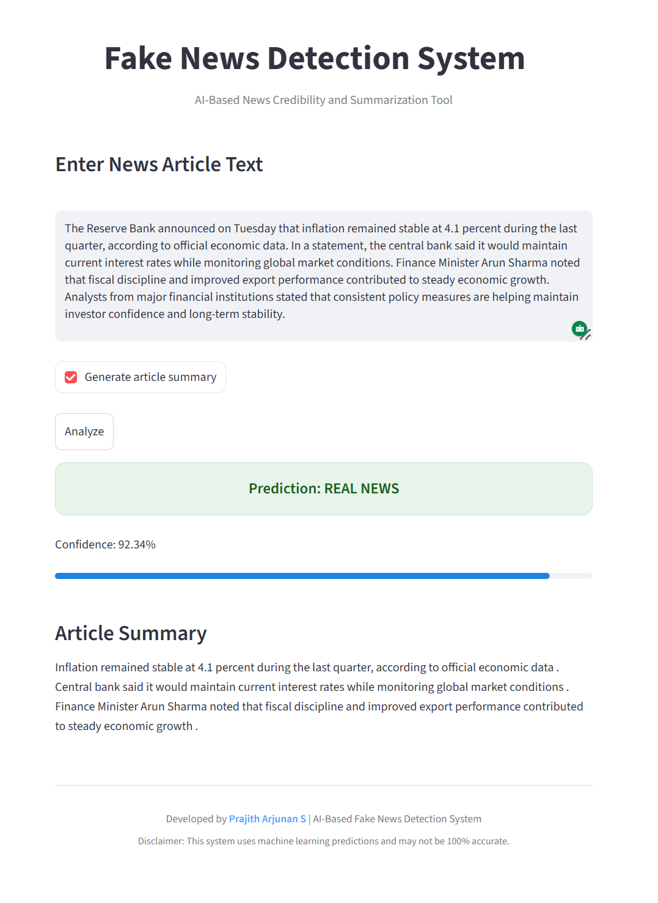
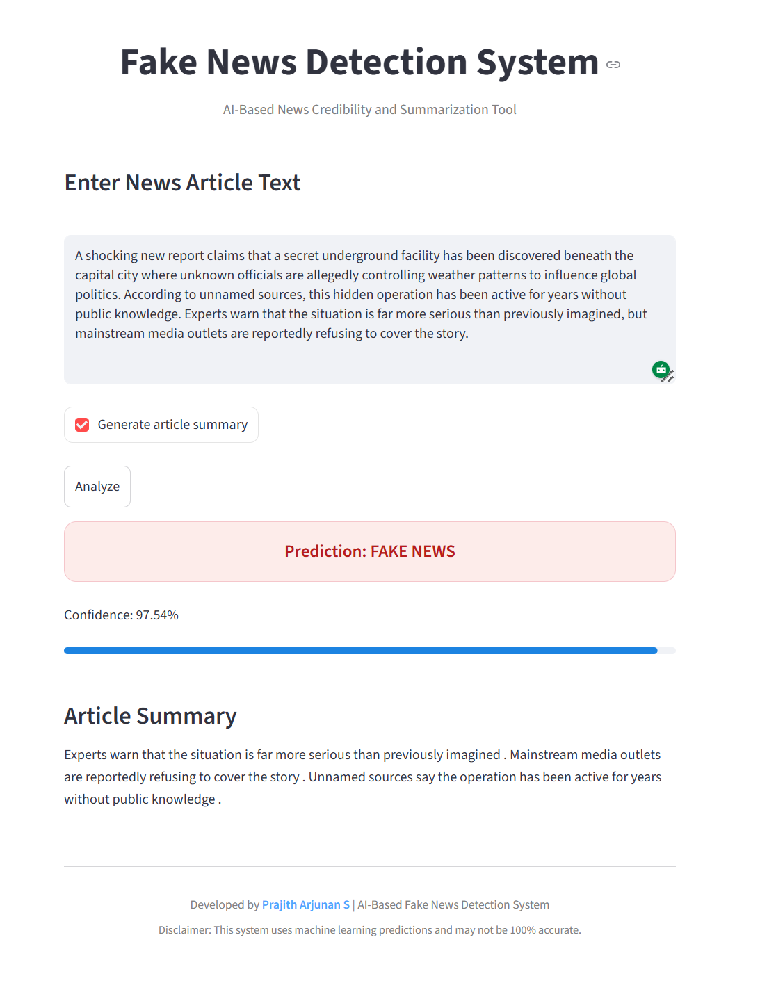

<p align="center">
  
</p>

<h1 align="center">Fake News Detection System</h1>

<p align="center">
  Machine Learning web application for classifying news articles as Real or Fake.
</p>

## Overview

A Machine Learning web application that classifies news articles as **Real** or **Fake** using Natural Language Processing techniques.

The model is built using **TF-IDF Vectorization** and **Logistic Regression**, and deployed using **Streamlit**.

---

## Model Performance

| Metric        | Value    |
|--------------|----------|
| Accuracy     | 98.53%   |
| ROC AUC      | 0.9987   |

### Model Evaluation

 &nbsp;&nbsp;&nbsp;


---

## Application Preview

### Home Interface

<p align="center">
  
</p>

### Real News Prediction

<p align="center">
  
</p>

### Fake News Prediction

<p align="center">
  
</p>

---

## Tech Stack

| Category        | Technology Used |
|----------------|----------------|
| Language        | Python |
| NLP Technique   | TF-IDF Vectorization |
| ML Algorithm    | Logistic Regression |
| Framework       | Streamlit |
| Visualization   | Matplotlib, Seaborn |

---

## Future Scope

- Deploy on cloud platforms (AWS, Azure, Streamlit Cloud)
- Integrate transformer-based models (BERT, RoBERTa)
- Add multilingual fake news detection
- Implement Explainable AI techniques (SHAP / LIME)
- Integrate real-time news APIs

---

## How to Run

```bash
git clone https://github.com/your-username/fake-news-detection.git
cd fake-news-detection
pip install -r requirements.txt
streamlit run app.py
```

---

## Author
Prajith Arjunan S <br>
B.Tech Computer Science
